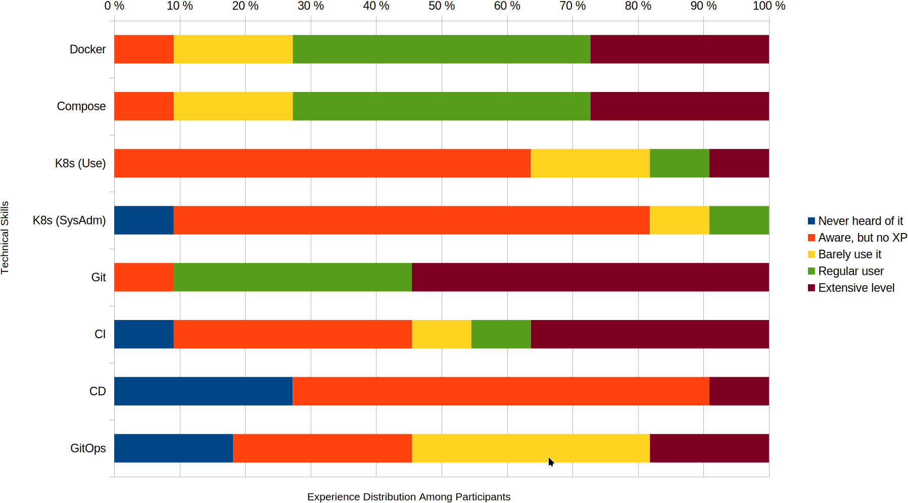
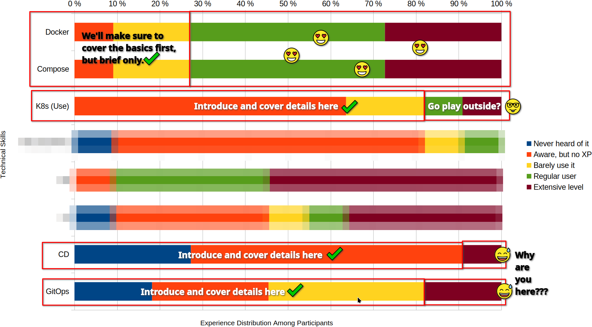
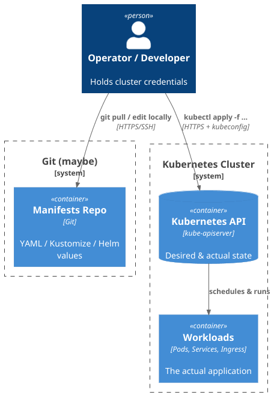
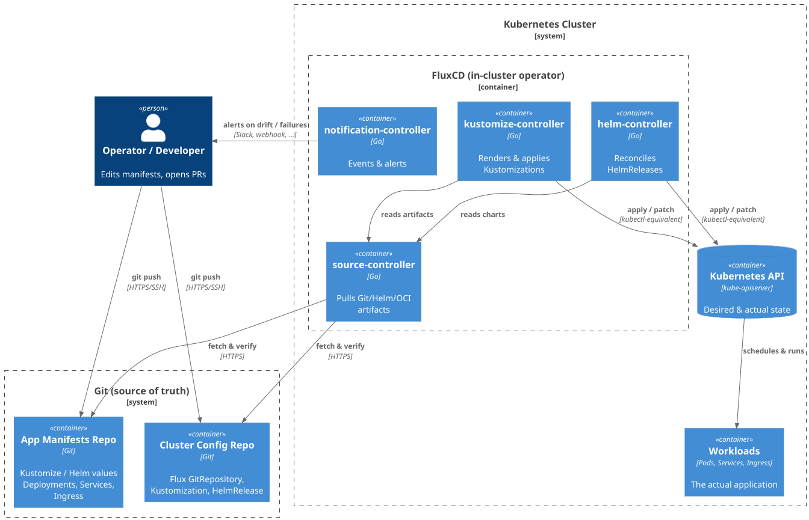

<!-- .slide: data-timing="0" -->
# Continuous Delivery for Dataverse on K8s
## “vlûch serviert” - Session 1

&nbsp;  

 <!-- .element: style="height: 2em; vertical-align: middle" --> Dataverse Community Meeting 2026

2026-05-12 | Oliver Bertuch <!-- .element: class="date-name" -->

---
# Logistics

### Session 1 :: 13:00 - 15:00
Get the ball rolling with Kubernetes and FluxCD

### Coffee Break :: 15:00 - 15:30
☕ 🍪

### Session 2 :: 15:30 - 17:00
Deploy Dataverse, play around, possibly External Secrets

### Facilities
🤷

---
# Session I

TODO: picture & agenda

----
# Warning

**Some stuff you're gonna see is not advised to try alone at home.** <i class="far fa-smile-wink"></i>

The ecosystem is still evolving. Depending on the topic, things might not be supported yet or we need to try them out here.

**You may be asked to open issues and describe problems.**  
**We appreciate you supporting us this way!**

Please feel welcome to join us:

1. https://chat.dataverse.org has a `containers` channel.  
   Ask for help, discuss ideas and much more fun!
2. Regular meetings of the working group.  
   Every first Thursday of the month, open to all.
3. Issues and Pull Requests are much appreciated!

----
# Your Questionaire Answers


----
# Takeaway for the workshop



<small>Also: no need to cover Git, skip K8s system administration and Continuous Integration.</small>

----
<!-- .slide: data-timing="1200" -->
# Bill of Materials 

- Everybody said they have Linux or Mac on their laptops 😍
- Everybody said they have enough resources (4 CPU, 16 RAM) 💪

### All aboard!
- You want AC power, plug in now. 🔌⚡🔋
- Who hasn't WiFi ready to go?
- Who hasn't Linux or MacOS?

### Get your first package

Go to [go.fzj.de/dcm26-repo](https://go.fzj.de/dcm26-repo) and clone it ([GitHub](https://github.com/gdcc/dcm2026-k8s-workshop)).

### Please set up shop now!

- Who has done their homework, who hasn't? (Tasks 0 and 1)


---
# Containers I
### Introduction
"Containers" are instances of "Images".

"Container Engine" manages the processes.  
(dockerd, containerd, runc, ...)

### Image Content
- Reduced **Operating System**  
- <i class="fas fa-minus-square"></i> minus kernel  
- <i class="fas fa-plus-square"></i> plus *whatever you put inside*  

----
# Containers II
### Organisation
To identify images, we use "Tags" and "Digests".

"Image tags" work similar to Git tags: named references.

🚨 Image tags are not necessarily frozen like Git tags! 🚨

----
# Containers III
### Creation
Images are built from instructions. ✅

Instructions create "Layers". 🥞

Layers can be defined programmatically or via instruction files (Dockerfile):

- `FROM`: Base Layer, usually some other image + tag
- `RUN`: Execute some instructions during build
- `COPY`: Copy from context into image
- (there are a few more, see [reference docs](https://docs.docker.com/reference/dockerfile))

Layers are squashable and explorable without running an image. 🗜️<i class="fas fa-binoculars"></i>

----
# Containers IV
### Compose
Docker Compose (and similar tools) create:

- Groups of containers,
- linked via overlay network,
- attaching storage volumes,
- watching their state, restart if necessary.

Describe deployments either simple or complex. <i class="fas fa-cogs"></i>

Great for development or simple production scenarios. 🫅

---
# Kubernetes I
### What is it?

- An **orchestrator** for containers across many machines.
- Treats workloads as **cattle, not pets** — replaceable, reschedulable.
- You declare the **desired state**; K8s reconciles reality towards it.
- Adds: scheduling, self-healing, scaling, service discovery, rollouts.

### What is it not?
A PaaS, a CI system or a magic "make my app cloud-native" button. 🪄❌

----
# Kubernetes II
### The Cluster

<grid>
<div>

#### Control Plane 🧐
- API Server (the only door in)
- etcd (state DB)
- Scheduler + Controllers (reconcilers)

</div><div>

#### Worker Nodes 💪
- Kubelet (node agent)
- Container runtime (containerd, …)
- Kube-proxy + CNI  
  (overlay network)

</div>
</grid>

You talk to the **API server** (via `kubectl`, FluxCD, ...).

Everything else is controllers watching the API and making it so. ✨

----
# Kubernetes III
### Workloads: Namespace, Pod, Deployment

<grid>
<div>

- **Namespace**: a scope/folder for resources (and policies, quotas, RBAC).
- **Pod**: 1+ containers sharing network & storage. The smallest unit. *Ephemeral.*
- **Deployment**: declares *how many* Pods of a given template should run. Handles rollouts.
- **Labels** glue things together - selectors find Pods by label.

</div><div>

```yaml
apiVersion: apps/v1
kind: Deployment
metadata:
  name: whoami
  namespace: whoami
spec:
  replicas: 1
  selector:
    matchLabels: { app: whoami }
  template:
    metadata:
      labels: { app: whoami }
    spec:
      containers:
        - name: whoami
          image: traefik/whoami:latest
          ports: [{containerPort: 8080}]
```

</div>
</grid>

----
# Kubernetes IV
### Networking: Service & Ingress

<grid style="grid-template-columns: 0.8fr 1.2fr">
<div>

- **Service**: stable virtual IP + DNS name in front of a moving set of Pods (selected by label).
  Cluster-internal by default.
- **Ingress**: HTTP(S) routing from *outside* the cluster to a Service.
  Implemented by an *Ingress Controller* (Traefik, NGINX, ...).

</div><div>

```yaml
kind: Service
spec:
  # Find by label which pod to target
  selector: {app: whoami}
  ports: [{port: 8080, targetPort: http}]
```
```yaml
kind: Ingress
spec: 
  rules:
    # Proxy -> Service -> Pod 
    - host: whoami.ct.gdcc.io
      http:
        paths: 
          - path: "/"
            pathType: "Prefix"
            backend:
                           service:
                             name: whoami
                             port:
                               name: http
``` 

</div>
</grid>

----
# Kubernetes V
### Storage & Config

Pods are ephemeral - anything written inside a container is gone on restart.
To persist or inject data, **mount a Volume**.

<grid style="grid-template-columns: 0.8fr 1.2fr">
<div>

- **PersistentVolumeClaim** (PVC): "I need *X* GiB with these access modes."
- **PersistentVolume** (PV): actual piece of storage, auto-provisioned by a StorageClass.
- **ConfigMap / Secret**: small key-value data, mountable as files or env vars.

</div><div>

```yaml
kind: PersistentVolumeClaim
metadata:
  name: washere-volume
  # ⚠️ PVC in namespace, PV in cluster!
  namespace: washere
spec: 
  accessModes: [ReadWriteOnce]
  resources:
    requests: {storage: 128Mi}
```
```yaml
# In the Pod spec:
volumes:
  name: htdocs
  persistentVolumeClaim: 
    claimName: washere-volume
```

</div>
</grid>

----
# Kubernetes VI
### Talking to the cluster: `kubectl`

Everything is a resource you can `get`, `describe`, `apply`, `delete`.

<table>
<tr><td>kubectl apply -f whoami.yaml</td><td>Send desired state to API</td></tr>
<tr><td>kubectl get pod -n whoami</td><td>List resources</td></tr>
<tr><td>kubectl describe deployment whoami</td><td>Detailed state + events</td></tr>
<tr><td>kubectl logs</td><td>Container STDOUT/STDERR</td></tr>
</table>

### Mental model
1. You `apply` YAML → API server stores **desired state**.
2. Controllers notice the diff → **reconcile** pods, services, ...
3. You `get` / `describe` to observe **actual state**.

----
# Kubernetes VII
### Summary

<grid>
<div>

### It provides...

- Scaling
- Combine and integrate
- Abstract and apply
- Clear DSL for Devs *and* Ops

</div><div>

### It requires...

- Skillset upgrade  
  (DevOps, GitOps, Cont. Delivery, ...)
- Very declarative way of thinking.

</div>
</grid>

----
<!-- .slide: data-timing="1800" -->
# Kubernetes VIII
### Exercise: Task 2
Deploy `whoami`, then `washere`, and poke around.

⏰ 30 minutes


---
# Kustomize I
### Patching YAML without templating

A **base** describes the app once. **Overlays** patch it per environment.  
No Helm-like `{{ templating }}`, just YAML on YAML.

```text
something/
├── base/ 
│   ├── kustomization.yaml # lists resources
│   ├── deployment.yaml
│   ├── service.yaml
│   └── ingress.yaml
└── overlays/
    ├── dev/kustomization.yaml (→ ../../base, + dev patches)
    └── prod/kustomization.yaml (→ ../../base, + prod patches)
```

----
# Kustomize II

<grid>
<div>

**`base/kustomization.yaml`**
```yaml
apiVersion: kustomize.config.k8s.io/v1beta1
kind: Kustomization
resources:
  - deployment.yaml
  - service.yaml
  - ingress.yaml
``` 

</div><div>

**`o/prod/kustomization.yaml`**
```yaml
apiVersion: kustomize.config.k8s.io/v1beta1
kind: Kustomization
resources:
  - ../../base

namespace: whoami-prod
images:
  - name: traefik/whoami
    newTag: v1.10
```

</div>
</grid>

Render locally: `kubectl kustomize overlays/prod`

----
<!-- .slide: data-timing="900" -->
# Kustomize III
### Exercise: Task 3
Use kustomize!

⏰ 15 minutes

---
# Continuous Delivery I
### From VCS to CI to CD to GitOps

<grid>
<div>

### Version Control System  
Record consecutive units of changes in commits, often using Git. 💾

</div><div>

### Continuous Integration
Build, test, package on every commit. Output: an artifact (e.g. a container image). 🧪📦

</div><div>

### Continuous Delivery
That artifact is **always deployable**, and getting it onto an environment is automated and boring. 🚚

</div><div>

### GitOps
A flavor of CD where **Git is the single source of truth** for the desired state. In-cluster agent reconciles reality towards it. 🤖

</div></grid>

----
# Continuous Delivery II
### The "classic" way: push from outside

<grid>
<div>

 <!-- .element: style="max-height: 38vh" -->

</div><div>

- Works. Familiar. Fast to start. ✅
- Cluster credentials leak outward (laptops, CI runners). 🔑😬
- Drift is invisible: `kubectl edit` in production leaves no trace. 👻
- *What is actually deployed?* → *Let me check my shell history...*
- What could possibly go wrong? 🙈

</div>
</grid>

----
# Continuous Delivery III
### The GitOps way: pull from inside

<grid style="grid-template-columns: 1.42fr 0.58fr">
<div>

 <!-- .element: style="max-height: 36vh" -->

</div><div>

- Git holds the **desired state**; cluster pulls it. 🔁
- All credentials live in cluster. 🔒
- Drift is detected and corrected automatically. 🕵️
- Audit trail =  
  `git log`. 📜

</div>
</grid>

----
# Continuous Delivery IV
### FluxCD in one slide

Set of K8s **Controllers** that turn Git/Helm repos into running workloads.

<table>
<tr><td>source</td><td>Fetches & verifies artifacts from <code>GitRepository</code>, <code>HelmRepository</code>.</td></tr>
<tr><td>kustomize</td><td>Renders <code>Kustomize</code> overlays and applies them.</td></tr>
<tr><td>helm</td><td>Reconciles <code>HelmRelease</code> objects (installs/upgrades charts).</tr>
<tr><td>notification</td><td>Events, alerts, webhooks.</td></tr>
</table>

Everything Flux does is itself a Kubernetes  
**custom resource**, so Flux configures Flux. 🌀

----
# Continuous Delivery V
### Source → Kustomization

Every interval: fetch → render → diff → apply → prune → report.  
Manual edits get reverted. 🔁

```yaml
apiVersion: source.toolkit.fluxcd.io/v1
kind: GitRepository
metadata: { name: workshop, namespace: flux-system }
spec:
  interval: 1m
  url: https://github.com/gdcc/dcm2026-k8s-workshop
  ref: { branch: main }
```
```yaml
apiVersion: kustomize.toolkit.fluxcd.io/v1
kind: Kustomization
metadata: { name: whoami, namespace: flux-system }
spec:
  interval: 5m
  sourceRef: { kind: GitRepository, name: workshop }
  path: ./task-3-fluxcd/whoami
  prune: true            # delete what's no longer in Git
  wait: true             # wait for resources to be ready
```

----
# Continuous Delivery VI

⚠️ Two different `kind: Kustomization` objects exist:

- `kustomize.config.k8s.io/v1beta1` - the **file** Kustomize reads.
- `kustomize.toolkit.fluxcd.io/v1` - the **Flux CR** that *points at* a folder containing the file above.

This is often a source of confusion. Established pattern:  
**Do not use filename `kustomize.ya?ml` for FluxCD.**  
It's reserved for *Kustomize*.

----
<!-- .slide: data-timing="1800" -->
# Continuous Delivery VII
### Exercise: Task 4
Let's do GitOps!

⏰ 30 minutes

🎯 Goal: feel the difference between  
*"I deployed it"* and   
*"the cluster keeps it deployed"*.


---
# ☕ Coffee! ☕

⏰ 30 minutes - meet you back here at 15:30.

<grid>
<div>

  ### $ whoami
   <!-- .element: style="height: 7vh; border-radius: 50%; margin: 0;" -->  
  Oliver Bertuch  
  [Central Library, FZJ, Germany](https://go.fzj.de/zb)

</div><div>

  ### $ reachout
  <i class="far fa-envelope"></i> o.bertuch@fz-juelich.de  
  <i class="fab fa-github"></i> [@poikilotherm](https://github.com/poikilotherm)

</div><div>

  ### $ ls /workplaces
  [FZJ RDM](https://www.fz-juelich.de/en/zb/open-science/research-data-management)  
  <i class="fas fa-plus"></i>
  [Dataverse Core Team Member](https://dataverse.org/about)

</div><div>

  ### $ attribution
  Slides licensed under [<!-- .element: style="max-height: 1.6rem;" -->](https://creativecommons.org/licenses/by-nd/4.0/),  
  Icons by [Font Awesome](https://fontawesome.com/license)  
  All images CC-BY  
  Logos are non-CC material

</div>

</grid>
