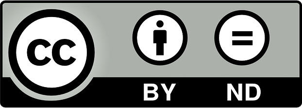

<!-- .slide: data-timing="0" -->

# Continuous Delivery for Dataverse on K8s
## “vlûch serviert” - Session 2

&nbsp;  

 <!-- .element: style="height: 2em; vertical-align: middle" --> Dataverse Community Meeting 2026

2026-05-12 | Oliver Bertuch <!-- .element: class="date-name" -->

---
# Logistics

### Session 2 :: 15:30 - 17:00
Deploy Dataverse, play around, possibly External Secrets

### Facilities
🤷

---

# Session II

TODO: pictures & agenda

----
# Dataverse Containers
### Our images

Community and IQSS supported images for the latest three releases plus `develop`.

Tags follow the [Bitnami pattern](https://docs.vmware.com/en/VMware-Tanzu-Application-Catalog/services/tutorials/GUID-understand-rolling-tags-containers-index.html).  
(`c` = current minor release):
  - *Rolling*:  
    `unstable` = `6.(c+1)-flavor`,  
    `latest` = `6.c-flavor, 6.(c-1)-flavor, 6.(c-2)-flavor`
  - *Fixed*:  
    `6.c-flavor-rX`, `6.(c-1)-flavor-rX`, `6.(c-2)-flavor-rX`

----

# Dataverse in Containers II
### Most important differences to classic installations

1. Any HTTP contact to Admin API: needs "unblock-key" policy!  
   <small>Exception: `docker exec curl` inside running container.</small>
2. Logs not written to `server.log` but stdout, use `docker logs`.
3. "JVM Options": most, but not all use Microprofile Config (yet).  
   <small>(Storage not enabled, use JVM_ARGS!)</small>
4. Inject secrets via mounted file or environment variable.  
   <small>`/secrets` is your friend</small>
5. Overlayfs is slow - back any place the app writes to with a volume.  
   <small>See also image docs for these locations!</small>
6. Think ephemeral - ideally you don't change the image's content!
7. Add container limits for RAM; 70% default Heap. Tunable using env vars.

----

# Dataverse in Containers III
### A simple example

---

# Dataverse in Kubernetes

    

---

# Dataverse in Kubernetes
### What we'll need

<grid>

### PostgreSQL
- StatefulSet
- PhysicalVolumeClaim
- Service
- DB Secret

### Solr
- StatefulSet
- PhysicalVolumeClaim
- Service
- Init Container for Core Config

### Dataverse
- StatefulSet
- multiple PVC
- Service
- Secrets
- ConfigMap (JVM Opts)

### ConfigBaker
- 2xJobs (Bootstrap, DB Opts)
- Secrets
- 3x ConfigMap (JVM Opts, DB Opts, Bootstrap Script)

</grid>

---

# Task (1h)

Let's build this together, step by step.

<!-- .slide: data-timing="0" -->

# Thank you for your attention!

<grid>

  ### $ whoami
   <!-- .element: style="height: 7vh; border-radius: 50%; margin: 0;" -->  
  Oliver Bertuch  
  [Central Library, FZJ, Germany](https://go.fzj.de/zb)

  ### $ reachout
  <i class="far fa-envelope"></i> o.bertuch@fz-juelich.de  
  <i class="fab fa-github"></i> [@poikilotherm](https://github.com/poikilotherm)

  ### $ ls /workplaces
  [FZJ RDM](https://www.fz-juelich.de/en/zb/open-science/research-data-management)  
  <i class="fas fa-plus"></i>
  [Dataverse Core Team Member](https://dataverse.org/about)

  ### $ attribution
  Slides licensed under [<!-- .element: style="max-height: 1.6rem;" -->](https://creativecommons.org/licenses/by-nd/4.0/),  
  Icons by [Font Awesome](https://fontawesome.com/license)  
  All images CC-BY  
  Logos are non-CC material

</grid>
