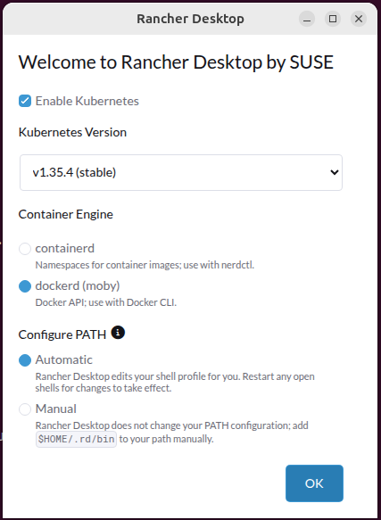
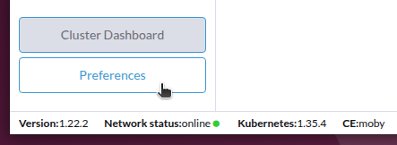
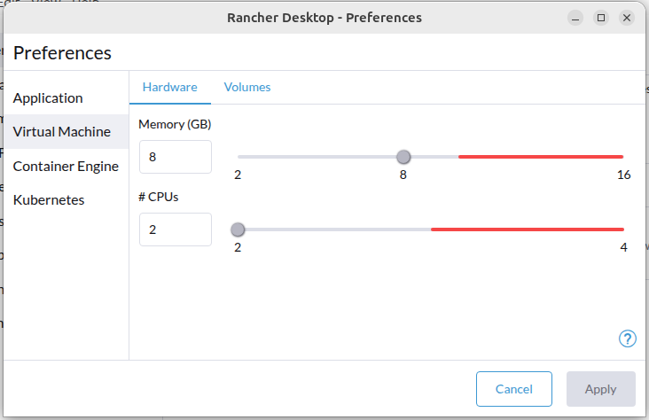
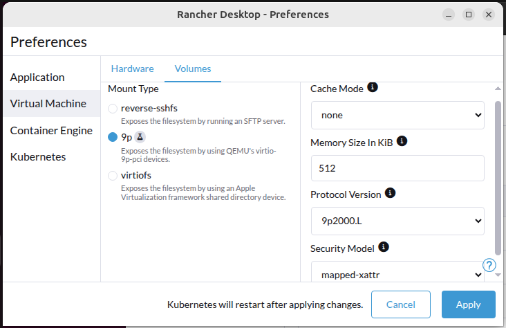
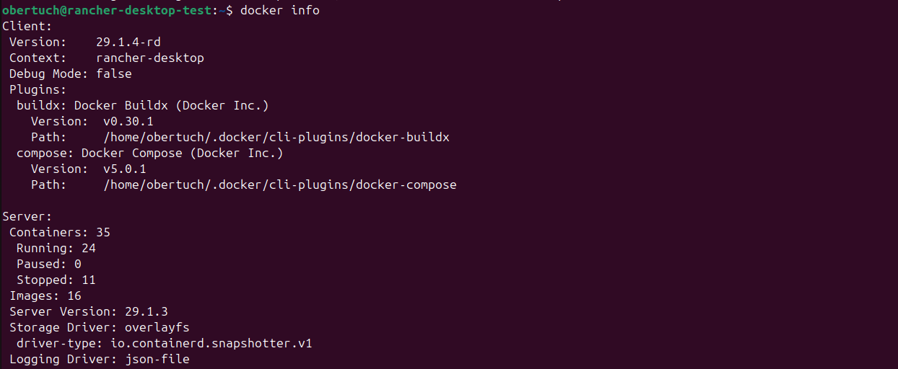
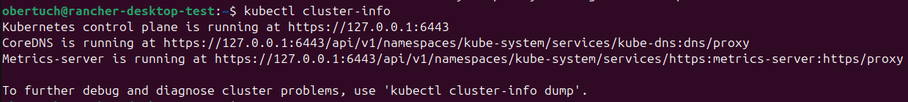
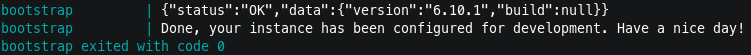

<!--
SPDX-FileCopyrightText: 2026 Forschungszentrum Jülich GmbH
SPDX-FileContributor: Oliver Bertuch

SPDX-License-Identifier: CC-BY-4.0
-->

# Task 1 - Set Up And Verify Kubernetes
Please make sure to have executed all steps from the [previous task](../task-0-prepare/README.md) before going through with this task.

## Summary
- This task is best prepared at home to avoid any onsite problems like bandwidth limitations.
- It expects you to use [Rancher Desktop](https://rancherdesktop.io/). YMMV if you use something else.

## Context
As we will work with Kubernetes, you need a test cluster. Please don't reuse any production clusters for experiments.
To set up a small Kubernetes on your laptop, there are multiple options:
- [Docker Desktop](https://www.docker.com/products/docker-desktop/) (GUI+VM)
- [Rancher Desktop](https://rancherdesktop.io/) (GUI+VM)
- [Colima](https://colima.run) (CLI+VM)
- [Minikube](https://minikube.sigs.k8s.io/docs/) (CLI+VM)

I recommend using *Rancher Desktop* if you have not a lot of experience.
It's open source and free for commercial use, unlike Docker Desktop.
You can follow the official [installation documentation](https://docs.rancherdesktop.io/getting-started/installation),
but there are also a plethora of tutorials in blog posts and videos on YouTube how to do that.

## Steps
### Step 1 - Install Rancher Desktop
Download and install as you see fit. It's probably best to follow the recommendations on https://docs.rancherdesktop.io/getting-started/installation.

If you want a clean environment that you can simply delete after the workshop (and you are **not** on Windows),
do this inside a fresh Linux VM with a Desktop environment. I recommend Ubuntu 24.04.
Please note: this will create the Rancher Desktop's internal VM inside that VM, which may be a toll on performance and your available RAM.
In doubt, install on your laptop directly. It's still easy to uninstall.

### Step 2 - Run and Configure Rancher Desktop
On first run, Rancher will ask you which container engine to use. I recommend going with "dockerd/moby":

Then, make sure to allocate ample resources. (Again, this is about Mac and Linux, Windows with WSL will be different.)

As Dataverse itself will require quite a lot of RAM, go with at least 8 GB for the Rancher internal VM. 2 CPUs will probably be fine.

As we will need to bind mount volumes and run a database, let's make sure we use a better volume driver.
- The default on Mac and Linux will be "reverse-sshfs". This has a poor performance, probably too slow for us.
- For Mac try "virtiofs". (I cannot test this, no Mac available.)
- On Windows, you have to figure something out. (I cannot test this, sorry.)
- For Linux, configure as shown below:

Apply and let the internal VM reboot. (See status bar)

### Step 3 - Verify tooling
The installer should have set up the necessary tools like `docker`, `docker compose`, and `kubectl` for you.
Please try executing these commands to verify it works:

- `docker info`  
  
- `kubectl cluster-info`  
  

### Step 4 - Pull Images
Please download the [compose.yml](./compose.yml) file (or clone this repo to your machine) and save it in a directory `test`.
Then run `cd test && docker compose up`.
This will jumpstart a local Dataverse deployment for you, which, once finished, will be available at http://localhost:8080.

*More important: this will make sure we don't need to pull these images again when in Barcelona!
They will be cached inside the internal VMs Moby Engine.*

## Next Task
After the next round of slides, we'll continue with [Task 2](../task-2-play-with-k8s/README.md). 