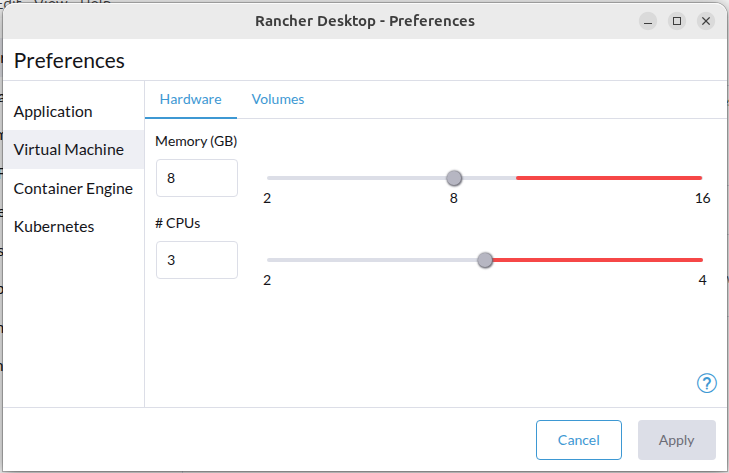

<!--
SPDX-FileCopyrightText: 2026 Forschungszentrum Jülich GmbH
SPDX-FileContributor: Oliver Bertuch

SPDX-License-Identifier: CC-BY-4.0
-->

# Task 5 - Dataverse on Kubernetes
Please make sure to have completed [Task 4](../task-4-fluxcd/README.md) before starting.
You'll need the FluxCD setup and your personal GitOps repository from there.

## Summary
We'll finally deploy a real Dataverse onto your cluster. Not by hand, but as a Kustomize **base + overlay**
that your in-cluster FluxCD will pick up and reconcile - exactly like the toy apps from Tasks 3 and 4,
just with grown-up dependencies attached:

- **PostgreSQL** as the metadata database,
- **Solr** as the search index,
- **Dataverse** itself as the application server,
- a ConfigBaker **Job** which bootstraps the deployed instance, and
- another **Job** that pokes database settings into Dataverse.

You'll meet a few new Kubernetes building blocks along the way:

- `StatefulSet` for the workloads that own persistent storage,
- headless `Service` for stable per-pod DNS names,
- `configMapGenerator` with `.env` files for JVM/MicroProfile Config.

By the end, you should be able to point your browser at `http://dv.ct.gdcc.io` and see a working Dataverse.
Yet deployed by Flux, not by you.

## Context

In Task 2 you ran a stateless `whoami` and a tiny stateful `washere`. Dataverse is *also* a stateful app,
but with three moving parts that need to find each other (PostgreSQL ↔ Dataverse ↔ Solr), plus secrets,
plus configuration, plus a bootstrap step. That's where `StatefulSet`, `configMapGenerator` and `Job` come in.

Recall from the slides what Dataverse in Containers brings to the table:

- logs go to **stdout** (no more `server.log` - use `kubectl logs`),
- configuration for JVM settings is (mostly) **MicroProfile Config** via env vars (`DATAVERSE_*`) plus database settings,
- secrets are **files** under `/secrets/k8s/...`, referenced from their mounting point via `${k8s.xxx}`,
- the container is **read-only-ish** and runs as **non-root** — back every writable path with a volume.

You don't have to learn all of that today. Just know it's there and that the manifests reflect it.

The base manifests in `base/` are pre-built for you. The overlay under `test/example/` is your starting point.
You will copy it into your GitOps repo, wire it up, push, and let Flux do the rest.

## Steps
### Step -1 - Make sure to provide 3 CPUs to K8s
In case of Rancher Desktop, make sure to use at least 3 CPUs from here on out!


### Step 0 - Make sure Flux is still happy
```shell
flux check
flux get sources git
flux get kustomizations
```

All `Ready=True`? Good. If not, hop back to Task 4 Step 4 and fix that first.
There's no point chasing Dataverse issues if the GitOps loop isn't closing.

Also set your shell variables again, in case you opened a fresh terminal:
```shell
export WORKSHOP=~/path/to/dcm2026-k8s-workshop
export GITOPS=~/path/to/dcm26-gitops
``` 

### Step 1 — Tour the base
Have a look at `base/`. Four folders, each a self-contained piece of the puzzle:

```text
base/ 
├── postgres/ # the database
├── solr/ # the search index (with an init container)
├── dataverse/ # the app server
└── jobs/ # the bootstrapper and the settings guy
```

Each folder is its own little Kustomize base with a `StatefulSet` (or `Job`), a `Service` and - for the stateful ones - a **headless** `Service` (`clusterIP: None`).
The headless one is what gives each Pod a stable DNS name like `postgres-0.postgres-headless.dataverse.svc.cluster.local`.
The "normal" Service load-balances and is what your application connects to.

A few things to notice as you read along:

- **Image names start with an underscore** (e.g. `_dataverse`, `_postgres`). Those are placeholders.
  The overlay replaces them via the `images:` transformer — same trick you saw in Task 3, just used more heavily.
  This way the base doesn't pin versions; each environment can.
- **Selectors and template labels are empty** (`matchLabels: {}`).
  Same Kustomize label-transformer trick as in Task 3.
- **Resource limits are set everywhere.** Dataverse will use 70% of its memory limit as Java heap by default,
  so the limit is the lever you actually pull. (See the slides on container limits.)
- **Security context is locked down** - non-root, dropped capabilities, `seccompProfile: RuntimeDefault`.
  This is the bare minimum for "Pod Security: restricted" namespaces...
- **The Dataverse Pod has a lot of volumes.** Exactly one of them is persistent (`data`).
  The rest are `emptyDir` or `ephemeral` — temp space, uploads buffer, ingest scratch, heap dumps.
  The container's root filesystem is *still* writable, as Payara needs to be happy.

Try rendering each base on its own to see what's there (and to convince yourself nothing's missing yet):
```shell
kubectl kustomize base/postgres
kubectl kustomize base/solr
kubectl kustomize base/dataverse
kubectl kustomize base/jobs
``` 

Don't apply anything yet. Bases without an overlay have no namespace, no image tags, and no secrets.
They won't deploy on their own.

### Step 2 — Tour the overlay

Now open `test/example/`. This is what an overlay tying the four bases together looks like:
```text
test/example/
├── configs/
│   ├── db-settings.yaml # Dataverse DB-level settings (key/value)
│   └── jvm-settings.env # MicroProfile Config env vars
├── ingress.yaml # route dv.ct.gdcc.io → Service "dataverse"
├── kustomization.yaml # the glue
├── namespace.yaml # Namespace "dataverse" with Pod Security = privileged
└── secrets.yaml # DB and Dataverse secrets (demo values only!)
```

Open `kustomization.yaml` and read it top to bottom. The interesting bits:

- `resources:` pulls in all four bases plus the local `namespace.yaml`, `secrets.yaml` and `ingress.yaml`.
- `images:` is where every `_placeholder` from the bases gets resolved to a real image and tag.
- `configMapGenerator:` builds two ConfigMaps from local files:
    - `dataverse-env-vars` from `configs/jvm-settings.env` — this is mounted into Dataverse as env vars.
    - `dataverse-db-settings` from `configs/db-settings.yaml` — consumed by the Job in Step 7.
- The hash-suffix trick from Task 3 is at work again: change an env file, get a new ConfigMap name, get a rolling restart. 🔥
- The `labels:` transformer at the bottom flags everything with `kustomize.toolkit.fluxcd.io/force: enabled`
  so Flux will replace immutable Job specs cleanly. (You can drop that in production once things settle.)

Have a peek at `configs/jvm-settings.env`. Two patterns to recognize:

- Plain values (`DATAVERSE_DB_HOST=postgres`) - `postgres` here is the Service name from `base/postgres`.
  In-cluster DNS does the rest. No IPs anywhere.
- References like `${k8s.databasePassword}` — Payara/MicroProfile Config reads those from files mounted
  under `/secrets/k8s/`, where the filename equals the key. The `secrets.yaml` in this folder is what gets
  mounted there. That's why you'll never see a password in plain env vars inside a Dataverse Pod.

Render the overlay (locally, just to look at it):
```shell
kubectl kustomize test/example | less
``` 

Things to spot:

- three StatefulSets, three Services, two headless Services, one Ingress, one Namespace,
- the `_dataverse` placeholder is gone — replaced with `gdcc/dataverse:6.10.1-noble`,
- the two ConfigMaps have hash suffixes,
- everything lives in the `dataverse` namespace.

### Step 3 — Move the overlay into your GitOps repo

Same shape as Task 4. Copy the example overlay into your GitOps repo and wire it into the environment:

```shell
mkdir -p "$GITOPS/infrastructure/test/dataverse"
cp -R "$WORKSHOP/task-5-dataverse/base" "$GITOPS/infrastructure/base/dataverse-stack"
cp -R "$WORKSHOP/task-5-dataverse/test/example/." "$$GITOPS/infrastructure/test/dataverse/"
```

> 💡 Feel free to pick different names. The only thing that matters is that the overlay's `resources:`
> entries point at the right relative paths inside your repo.

Render it locally one last time to make sure your paths resolve:
```shell
kubectl kustomize "$GITOPS/infrastructure/test/dataverse" > /dev/null && echo OK
```

Now include the overlay in the environment by editing `$GITOPS/infrastructure/test/kustomization.yaml`:
```yaml
resources:
  - washere
  - whoami
  - dataverse # ← new
``` 

### Step 4 — Push and watch Flux do the work

```shell
cd "$GITOPS"
git add infrastructure
git commit -m "Deploy Dataverse via Flux"
git push
flux reconcile kustomization infrastructure --with-source
```

In a second terminal, keep an eye on things:
```shell
flux events --watch
``` 

Then watch the namespace come alive:
```shell
kubectl -n dataverse get pods -w
```

The order you'll see (roughly):

1. `postgres-0` becomes `Running` first — it has no dependencies.
2. `solr-0` follows, after its init container has copied the core template.
3. `dataverse-0` starts pulling its image (it's a big one, be patient) and reports `Ready` once `/robots.txt` returns 200.

This usually takes a couple of minutes on first run. If a Pod is `CrashLoopBackOff`, jump to Step 6.

### Step 5 — Open Dataverse

```shell
curl -I http://dv.ct.gdcc.io
open http://dv.ct.gdcc.io # or xdg-open / your browser
```

You should see the Dataverse landing page. Log in with the default `dataverseAdmin` / `admin` (it's a
disposable test cluster — please don't reuse those credentials anywhere real 🙏).

If `curl` can't resolve the host, fall back to the techniques from Task 2 Step 1.

### Step 6 — Poke around like a grown-up

Now that everything is up, get comfortable with the moving parts:
```shell
kubectl config set-context --namespace dataverse --current

# Who's running?
kubectl get statefulset,svc,ingress,pvc,configmap,secret,job

# Logs (note: no more server.log, this is the new "tail -f")
kubectl logs statefulset/dataverse -f
kubectl logs statefulset/postgres
kubectl logs statefulset/solr

# What got mounted where?
kubectl describe pod dataverse-0 | sed -n '/Volumes:/,/QoS/p'

# Inspect the generated ConfigMaps (note the hash suffixes!)
kubectl get cm
kubectl describe cm $(kubectl get cm -o name | grep dataverse-env-vars)

# Connect into a running container for ad-hoc debugging
kubectl exec -it dataverse-0 -- bash
```

Inside the Dataverse Pod, the things from the slides become tangible:
```shell
ls /secrets/k8s       # the files Payara reads via MPCONFIG
env | grep DATAVERSE_ # env vars from the generated ConfigMap
``` 

### Step 7 — Change a setting via Git

Let's exercise the GitOps loop with something Dataverse-flavored.
Open `$GITOPS/infrastructure/test/dataverse/configs/jvm-settings.env` and add (or change) a value, e.g.:
```env
DATAVERSE_MAIL_SYSTEM_EMAIL=Hello from Flux <flux@mailinator.com>
```

Commit and push:
```shell
git add infrastructure/test/dataverse/configs/jvm-settings.env
git commit -m "Tweak system email"
git push
flux reconcile kustomization infrastructure --with-source
``` 

Watch what happens:
```shell
kubectl get cm -w # a NEW dataverse-env-vars-appears
kubectl get pods -w # dataverse-0 gets recreated by the StatefulSet
```

Same trick as in Task 3, just on a much larger app.
Edited a file → new hash → new ConfigMap name → spec changed → controlled rollout. 
No `kubectl rollout restart`. No shelling into the Pod. No Helm values file. Just Git.

### Step 8 — (Optional) Re-run the bootstrap Job

The `db-settings` Job ran once and exited. If you want to apply DB settings again (say, after editing
`configs/db-settings.yaml`):
```shell
kubectl delete job db-settings
flux reconcile kustomization infrastructure
``` 

Flux will re-create the Job from Git and run it once more. The `kustomize.toolkit.fluxcd.io/force` label
you saw in the overlay is what allows Flux to replace Jobs cleanly (their `spec.template` is immutable).

### Step 9 — (Optional) Break something on purpose

Same playbook as Task 4 Step 9, just more interesting victims:

<!-- TODO: check these, some are phishy -->

- **Scale Solr down on purpose.** `kubectl scale statefulset/solr --replicas=0`.
  Watch Dataverse start failing search requests. Then `flux reconcile kustomization infrastructure` and Flux scales it back up.
- **Delete the Ingress.** `kubectl delete ingress application`. Wait a minute. Flux puts it back.
- **Edit a JVM setting in the live ConfigMap.** `kubectl edit cm dataverse-env-vars-<hash>`. Reconcile.
  Flux replaces it with the one rendered from Git, the StatefulSet notices, the Pod restarts.

> 💡 None of these were nice things to do to a real Dataverse. They're great things to do to a *test*
> Dataverse running on your laptop.

## Next Task
This is the last hands-on task of the workshop. 🎉

If there's time left and the room is curious, we'll have a look at **External Secrets** -
how to stop checking demo passwords into Git and start pulling them from a real secret store instead.